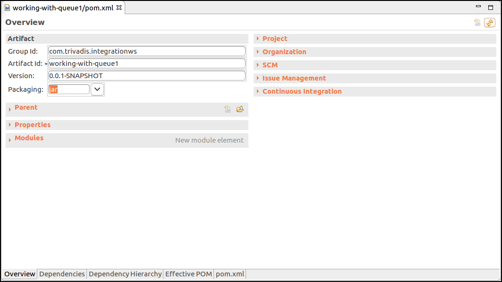

# Producing and Consuming AciveMQ using Java Message Service (JMS)
In this workshop we will learn how to use the [Java Message Service (JMS) API](https://en.wikipedia.org/wiki/Java_Message_Service).

JMS is a Java API and therefore only available from the Java Virtual Machine. So you need to use a language based on the JVM, such as of course Java. We will be using some sample Java classes to see how wokring with Queues and Topics over JMS works. 

We will first see how it is to work with Java messaging using plain JMS. Then we will be using the Spring Framwork and see how it can simplify working with JMS by quite a bit. 

Start the Eclipse IDE if not yet done. 

## Working with Queues from JMS

Create a new [Maven project](../99-misc/97-working-with-eclipse/README.md) and in the last step use `com.trivadis.integration.ws` for the **Group Id** and `working-with-queue` for the **Artifact Id**.

### Creating the project definition (pom.xml)

Navigate to the **pom.xml** and double-click on it. The POM Editor will be displayed. 



You can either use the GUI to edit your pom.xml or click on the last tab **pom.xml** to switch to the "code view". Let's do that. 

You will see the still rather empty definition.

```
<project xmlns="http://maven.apache.org/POM/4.0.0" xmlns:xsi="http://www.w3.org/2001/XMLSchema-instance" xsi:schemaLocation="http://maven.apache.org/POM/4.0.0 http://maven.apache.org/xsd/maven-4.0.0.xsd">
  <modelVersion>4.0.0</modelVersion>
  <groupId>com.trivadis.integrationws</groupId>
  <artifactId>working-with-queue</artifactId>
  <version>0.0.1-SNAPSHOT</version>
</project>
```

First let's add the dependencies for the project. Copy the following block right after the <version> tag, before the closing </project> tag. 

```
   <properties>
        <activemq-version>5.7.0</activemq-version>
		<slf4j-version>1.6.6</slf4j-version>
    </properties>

    <dependencies>
        <dependency>
            <groupId>org.apache.activemq</groupId>
            <artifactId>activemq-core</artifactId>
            <version>${activemq-version}</version>
        </dependency>
		<dependency>
		  	<groupId>org.slf4j</groupId>
		    <artifactId>slf4j-api</artifactId>
		    <version>${slf4j-version}</version>
		</dependency>
		<dependency>
		    <groupId>org.slf4j</groupId>
		    <artifactId>slf4j-log4j12</artifactId>
		    <version>${slf4j-version}</version>
		</dependency>
    </dependencies>
```

### Writing a Producer

First create a new Java Package `org.apache.activemq.simple.queue` in the folder **src/main/java**.

Create a new Java Class `SimpleProducer` in the package `org.apache.activemq.simple.queue` just created. 

Add the following code to the empty class. 

``` 
package org.apache.activemq.simple.queue;

import org.apache.commons.logging.Log;
import org.apache.commons.logging.LogFactory;

import javax.jms.*;
import javax.naming.Context;
import javax.naming.InitialContext;

public class SimpleProducer {
    private static final Log LOG = LogFactory.getLog(SimpleProducer.class);

    private static final Boolean NON_TRANSACTED = false;
    private static final long MESSAGE_TIME_TO_LIVE_MILLISECONDS = 0;
    private static final int MESSAGE_DELAY_MILLISECONDS = 100;
    private static final int NUM_MESSAGES_TO_BE_SENT = 100;
    private static final String CONNECTION_FACTORY_NAME = "myJmsFactory";
    private static final String DESTINATION_NAME = "queue/simple";

    public static void main(String args[]) {
        Connection connection = null;

        try {
            // JNDI lookup of JMS Connection Factory and JMS Destination
            Context context = new InitialContext();
            ConnectionFactory factory = (ConnectionFactory) context.lookup(CONNECTION_FACTORY_NAME);
            Destination destination = (Destination) context.lookup(DESTINATION_NAME);

            connection = factory.createConnection();
            connection.start();

            Session session = connection.createSession(NON_TRANSACTED, Session.AUTO_ACKNOWLEDGE);
            MessageProducer producer = session.createProducer(destination);

            producer.setTimeToLive(MESSAGE_TIME_TO_LIVE_MILLISECONDS);

            for (int i = 1; i <= NUM_MESSAGES_TO_BE_SENT; i++) {
                TextMessage message = session.createTextMessage(i + ". message sent");
                LOG.info("Sending to destination: " + destination.toString() + " this text: '" + message.getText());
                producer.send(message);
                Thread.sleep(MESSAGE_DELAY_MILLISECONDS);
            }

            // Cleanup
            producer.close();
            session.close();
        } catch (Throwable t) {
            LOG.error(t);
        } finally {
            // Cleanup code
            // In general, you should always close producers, consumers,
            // sessions, and connections in reverse order of creation.
            // For this simple example, a JMS connection.close will
            // clean up all other resources.
            if (connection != null) {
                try {
                    connection.close();
                } catch (JMSException e) {
                    LOG.error(e);
                }
            }
        }
    }
}

```
### Define the JNDI settings for JMS

Create a new file `jndi.properties` in the folder **src/main/resources** and add the following settings. 

``` 
# JNDI properties file to setup the JNDI server within ActiveMQ

#
# Default JNDI properties settings
#
java.naming.factory.initial = org.apache.activemq.jndi.ActiveMQInitialContextFactory
java.naming.provider.url = tcp://localhost:61616

#
# Set the connection factory name(s) as well as the destination names. The connection factory name(s)
# as well as the second part (after the dot) of the left hand side of the destination definition
# must be used in the JNDI lookups.
#
connectionFactoryNames = myJmsFactory
queue.queue/simple = test.queue.simple
``` 

This will tell the program where to find the ActiveMQ broker as well as which Queue to use. 

### Runing the Producer

In order to run the Producer class from the command line, we need to create a Maven profile. Add the following lines to the `pom.xml`, just before the ending `</project>` tag.

```
    <profiles>
        <profile>
            <id>producer</id>
            <build>
                <defaultGoal>package</defaultGoal>
                <plugins>
                    <plugin>
                        <groupId>org.codehaus.mojo</groupId>
                        <artifactId>exec-maven-plugin</artifactId>
                        <executions>
                            <execution>
                                <phase>package</phase>
                                <goals>
                                    <goal>java</goal>
                                </goals>
                                <configuration>
                                    <mainClass>org.apache.activemq.simple.queue.SimpleProducer</mainClass>
                                </configuration>
                            </execution>
                        </executions>
                    </plugin>
                </plugins>
            </build>
        </profile>
    </profiles>
``` 

In a terminal window, navigate to the project folder and enter

``` 
mvn package
``` 

to compile the project. If it is successful, you can then run the producer using

``` 
mvn -P producer
``` 

Check with the ActiveMQ Web Console that you have a queue **test.queue.simple** and that it contains 100 messages. 


### Writing a Consumer

Now let's write the consumer. In the same Java Package `org.apache.activemq.simple.queue` create a new Java class `SimpleConsumer` and add the following code.

``` 
package org.apache.activemq.simple.queue;

import org.apache.commons.logging.Log;
import org.apache.commons.logging.LogFactory;

import javax.jms.*;
import javax.naming.Context;
import javax.naming.InitialContext;

public class SimpleConsumer {
    private static final Log LOG = LogFactory.getLog(SimpleConsumer.class);

    private static final Boolean NON_TRANSACTED = false;
    private static final String CONNECTION_FACTORY_NAME = "myJmsFactory";
    private static final String DESTINATION_NAME = "queue/simple";
    private static final int MESSAGE_TIMEOUT_MILLISECONDS = 120000;

    public static void main(String args[]) {
        Connection connection = null;

        try {
            // JNDI lookup of JMS Connection Factory and JMS Destination
            Context context = new InitialContext();
            ConnectionFactory factory = (ConnectionFactory) context.lookup(CONNECTION_FACTORY_NAME);
            Destination destination = (Destination) context.lookup(DESTINATION_NAME);

            connection = factory.createConnection();
            connection.start();

            Session session = connection.createSession(NON_TRANSACTED, Session.AUTO_ACKNOWLEDGE);
            MessageConsumer consumer = session.createConsumer(destination);

            LOG.info("Start consuming messages from " + destination.toString() + " with " + MESSAGE_TIMEOUT_MILLISECONDS + "ms timeout");

            // Synchronous message consumer
            int i = 1;
            while (true) {
                Message message = consumer.receive(MESSAGE_TIMEOUT_MILLISECONDS);
                if (message != null) {
                    if (message instanceof TextMessage) {
                        String text = ((TextMessage) message).getText();
                        LOG.info("Got " + (i++) + ". message: " + text);
                    }
                } else {
                    break;
                }
            }

            consumer.close();
            session.close();
        } catch (Throwable t) {
            LOG.error(t);
        } finally {
            // Cleanup code
            // In general, you should always close producers, consumers,
            // sessions, and connections in reverse order of creation.
            // For this simple example, a JMS connection.close will
            // clean up all other resources.
            if (connection != null) {
                try {
                    connection.close();
                } catch (JMSException e) {
                    LOG.error(e);
                }
            }
        }
    }
}
``` 

### Runing the Consumer
In order to run the Consumer class from the command line, we need to create another Maven profile. Add the following lines to the `pom.xml`, just before the ending `</profiles>` tag.

```
        <profile>
            <id>consumer</id>
            <build>
                <defaultGoal>package</defaultGoal>
                <plugins>
                    <plugin>
                        <groupId>org.codehaus.mojo</groupId>
                        <artifactId>exec-maven-plugin</artifactId>
                        <executions>
                            <execution>
                                <phase>package</phase>
                                <goals>
                                    <goal>java</goal>
                                </goals>
                                <configuration>
                                    <mainClass>org.apache.activemq.simple.queue.SimpleConsumer</mainClass>
                                </configuration>
                            </execution>
                        </executions>
                    </plugin>
                </plugins>
            </build>
        </profile>
``` 

In a terminal window, navigate to the project folder and enter

``` 
mvn package
``` 

to compile the project. If it is successful, you can then run the producer using

``` 
mvn -P consumer
``` 

## Working with Topics from JMS


## Spring Boot

<OrderTransaction>
  <id>1</id>
  <from>you</from>
  <to>me</to>
  <amount>200</amount>
</OrderTransaction>