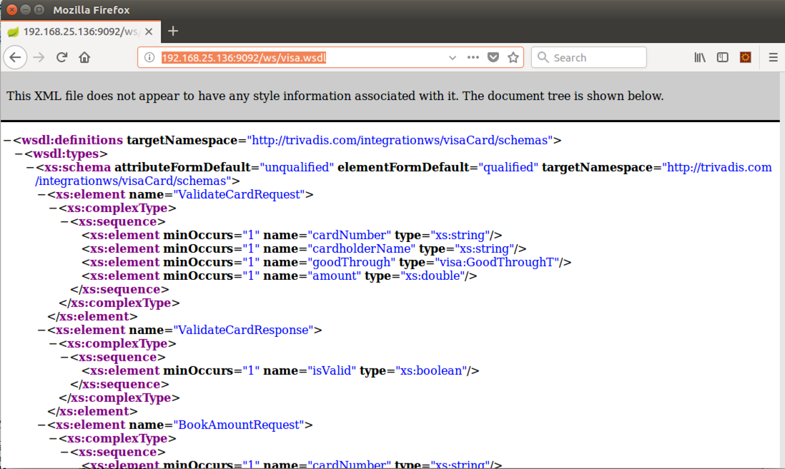
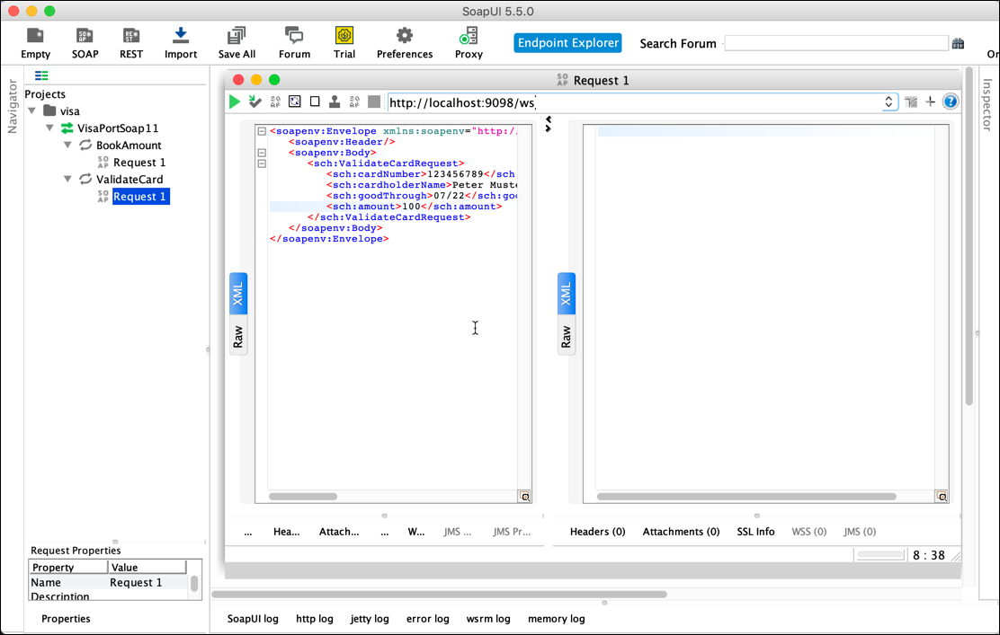
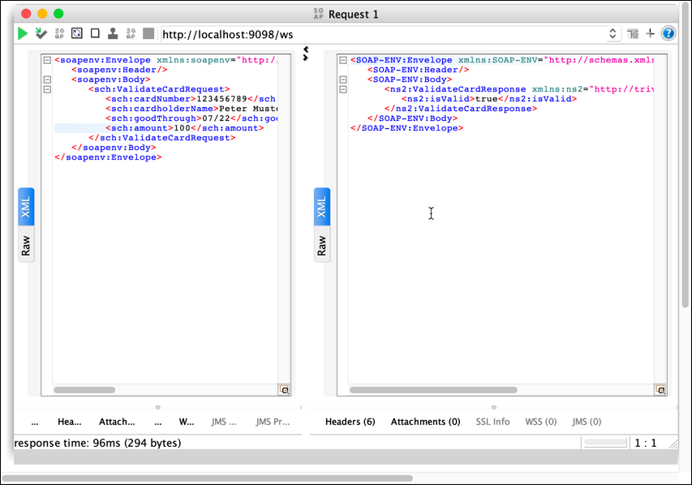
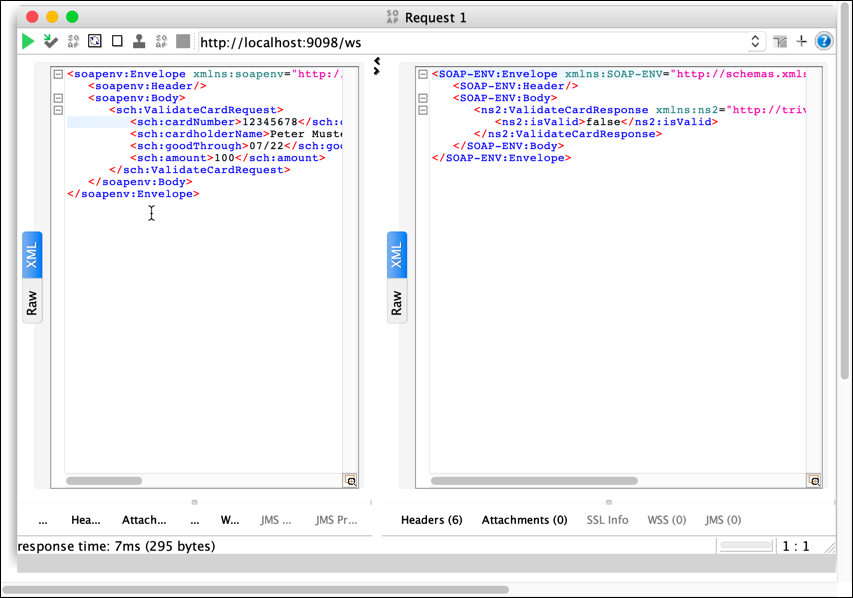

# SOAP Web Service for Credit Card Validation

In this workshop we will learn how to use an existing SOAP Web Service from the testing tool called [SoapUI](http://soapui.org).

For our tests we will deploy a fictitious web service for checking a credit card and then use SoapUI to invoke the service. Both the Web Service as well as SoapUI cannot be started as a Docker Container, therefore our Docker Stack is not used by this workshop.

## Install SoapUI

SoapUI is a very popular tool for testing both REST and SOAP services. There is an enterprise as well as an open-source edition available. As it is a Rich-Client, it can only be started inside a Docker container, if used headless (= without the GUI). In our case, we want to use the GUI, so we have to install it on our local machine. 

SoapUI can be installed on Mac OS-X, Windows and Linux. Download and install the version corresponding with your operating system from [here](https://www.soapui.org/downloads/soapui.html).

Once it is installed, click on the icon to start it. You should get the SoapUI Home screen as shown below. 


## Deploy the Web Service

The demo Web Service for credit card validation is not (yet) available as a Docker container. 
Therefore we have to conventionally start it as a Java package.

You can either download the pre-built JAR from the GitHub project or compile the source code. 

### Download pre-built JAR 

You can download the JAR from the following link: 
<https://github.com/gschmutz/integration-architecture-workshop/releases/download/0.1.0/visa-web-service-0.1.0.jar>. Download it to your local hard drive or into the Virtual Machine (if using the local VM or Lightsail), using the `wget` command (in on Linux)

```
wget https://github.com/gschmutz/integration-architecture-workshop/releases/download/0.1.0/visa-web-service-0.1.0.jar
```

After successfully downloading the JAR, you can start it using the 'java -jar` command:

```
java -jar visa-web-service-0.1.0.jar
```

### Compile the source code 

Alternatively you can also build-it from the source. The source code is available in the GitHub project [here](./webservice/VisaCardService). It's a Maven project and can be built using the following command. 

```
mvn package -Dmaven.test.skip=true
```

If built successfully, you can start it using the 'java -jar` command:

```
java -jar visa-web-service-0.1.0.jar
```

## Display the WSDL of the Web Service

In a browser, navigate to the WSDL <http://integrationplatform:9098/ws/visa.wsdl>

The WSDL should be retrieved from the service as shown below. 



Check the endpoint in the `<service>` declaration. This is the address of the endpoint where the service is available.  

## Testing it from SoapUI

In SoapUI, create a new project by right-clicking on **Project** and select **New SOAP Project**


Enter `http://integrationplatform:9098/ws/visa.wsdl` into the **Initial WSDL** field and click **OK**


The WSDL will be interpreted by SoapUI and a request will be generated for each operation in the WSDL. In our case it is the operation **BookAmount** and **ValidateCard**. You can see these in the Project tree on the left side.


If you double-click on the **Request 1** of the **ValidateCard** operation, a window will open showing the SOAP Request message generated based on the information in the WSDL. You can see the `<soapenv:Envelope>` element as well as the `<soapenv:Body>` field. In between the body is the payload you can control for the **ValidateCard**  request.

Change the message corresponding to the following snippet:

```
         <sch:cardNumber>123456789</sch:cardNumber>
         <sch:cardholderName>Peter Muster</sch:cardholderName>
         <sch:goodThrough>07/22</sch:goodThrough>
         <sch:amount>100</sch:amount>
```

so that the request looks like shown below



Now click on the green icon on the top left of the request window to send the request to the Web Service. `cardNumber` set to `123456789` is a valid number and therefore a value of `true` is returned for the `isValid` field. 



If you try with anyother number, you will see that the service returns `false` instead. 




